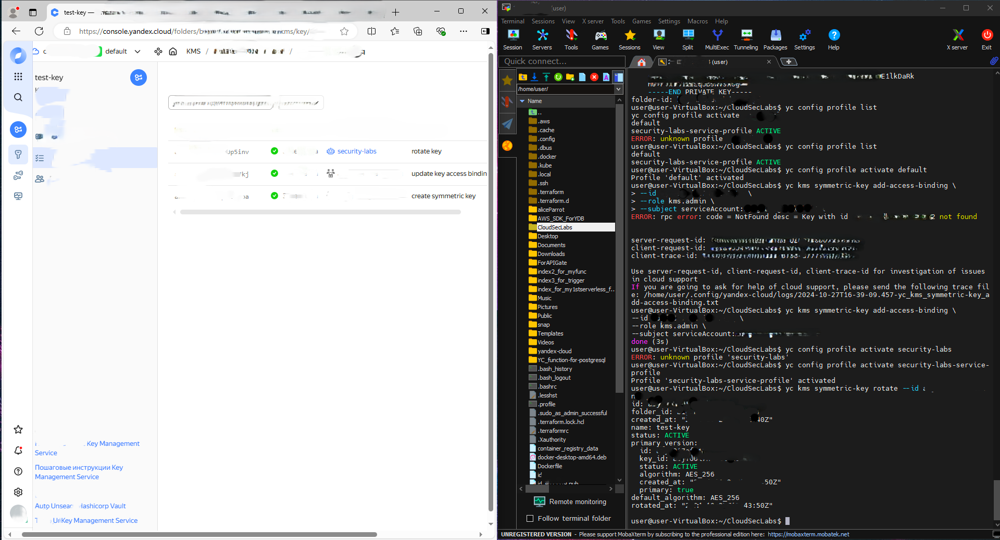

# Service Account based KMS Key Rotation

This lab demonstrates how to securely rotate a KMS encryption key
in Yandex Cloud using a dedicated service account instead of
user credentials.

## Why this matters

In production environments, cryptographic key operations must not
depend on personal user accounts.

This lab shows how to:
- delegate key management permissions
- use a service account for automation
- perform auditable KMS key rotation
- follow the principle of least privilege

## Scenario

A service account is created specifically for managing
KMS encryption keys.

The service account:
- does not have broad cloud permissions
- is granted access only to a specific KMS key
- performs a key rotation operation

All actions are logged and can be audited.

## Architecture

User (Owner/Admin)
→ IAM
→ Service Account
→ KMS Symmetric Key
→ Key Version Rotation

## Roles and Permissions

- User account:
  - Creates service account
  - Assigns IAM bindings

- Service account:
  - kms.admin role **only on the target key**
  - No permissions on unrelated resources

## Result Verification

After rotation:
- A new key version is created
- The operation is visible in KMS audit logs
- The initiator is the service account

This confirms correct IAM delegation and secure key management.

## Audit Evidence

The screenshot below shows that the key rotation
operation was performed by the service account.

